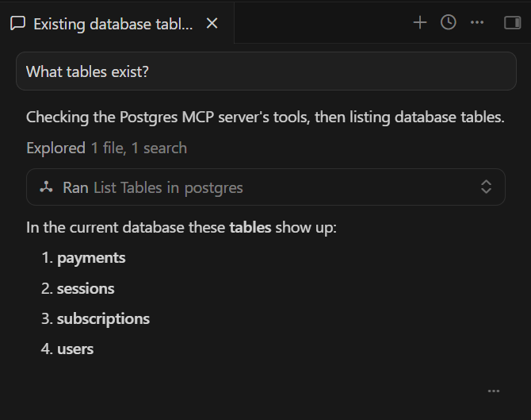
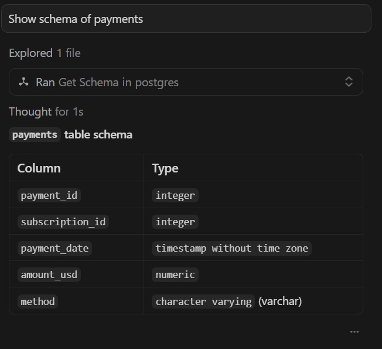
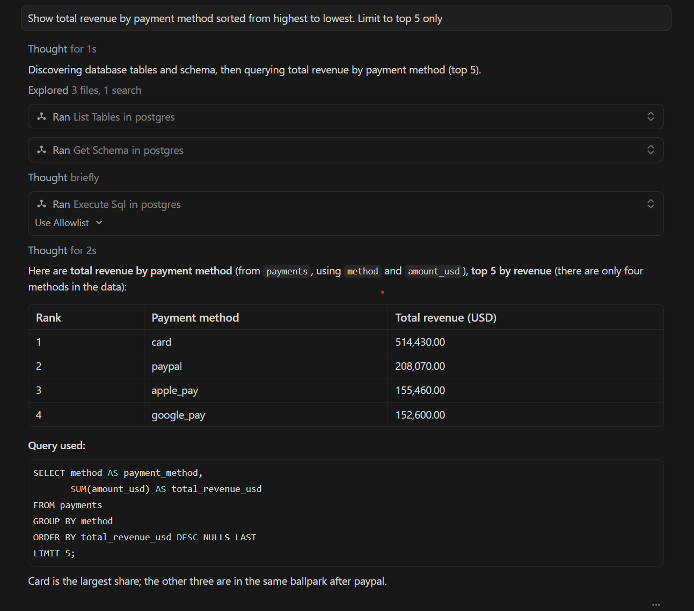

# PostgreSQL MCP Server

An MCP server that exposes PostgreSQL database operations as tools for AI assistants.

## What is MCP?

Model Context Protocol (MCP) connects AI assistants to external tools and data. This server lets AI assistants execute SQL queries and inspect your PostgreSQL database schema.

## Setup

**Python version:** This project currently supports Python 3.10–3.13. Python 3.14 is excluded due to upstream dependency wheel support (e.g., `psycopg2-binary` and `pydantic-core`).

### 1. Install Dependencies

> **Note:** This project uses Poetry for dependency management. If you don't have Poetry installed, you can install it with:
> ```bash
> curl -sSL https://install.python-poetry.org | python3 -
> ```
> See the [official Poetry documentation](https://python-poetry.org/docs/#installation) for alternative installation methods.

```bash
poetry install
```

### 2. Configure Database

Copy `.env.example` to `.env` and add your PostgreSQL credentials:

```bash
cp .env.example .env
```

Edit `.env`:
```
DB_NAME=your_database
DB_USER=postgres
DB_PASSWORD=your_password
DB_HOST=localhost
DB_PORT=5432
```

## Testing

### MCP Inspector (Recommended)

> **Note:** The Inspector runs via `npx`, so you need Node.js (which includes npm). If you don't have it installed, get it from the official Node.js installer.

```bash
npx @modelcontextprotocol/inspector poetry run python postgres-mcp-server/main.py
```

This opens a web UI where you can:
- View available tools under the **Tools** tab
- Test `list_tables`, `get_schema`, and `execute_sql`
- See real-time results

### Quick Test

```bash
poetry run python postgres-mcp-server/main.py
```

Press `Ctrl+C` to stop. No errors = working correctly.

## Available Tools

- **`list_tables()`** - Returns the list of tables in the database  
- **`get_schema(table)`** - Returns column names and data types for a given table  
- **`execute_sql(sql)`** - Executes read-only SQL queries (generated from natural language by AI) and returns results as structured dictionary output  


## Safety Constraints

- Only SELECT queries are allowed  
- DDL/DML operations (INSERT, UPDATE, DELETE, DROP, ALTER, TRUNCATE, CREATE) are blocked  
- Queries are expected to include a LIMIT clause (or will be automatically limited) to prevent large result sets  
- Queries are validated against known tables using information_schema  

## Connect to Cursor

Add to your Cursor MCP config (global settings):

```json
{
  "mcpServers": {
    "postgres": {
      "command": "poetry",
      "args": ["-C", "/absolute/path/to/postgres-mcp-server", "run", "python", "postgres-mcp-server/main.py"]
    }
  }
}
```

Replace `/absolute/path/to/postgres-mcp-server` with your actual project path.

## Example Outputs







